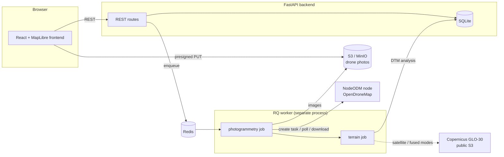

# Keyline Studio

A free, non-commercial keyline-design planning tool. Draw an area of interest
(AOI) on a map anywhere on Earth; the backend fetches Copernicus GLO-30
satellite elevation data, runs a hydrological analysis pipeline, detects
candidate **keypoints** (the slope break where a steeper upper valley meets the
flatter lower valley), and generates **keylines** (the contour through each
keypoint). Optionally upload a higher-resolution drone DEM (GeoTIFF) that
overrides the satellite data within its footprint.

> **Elevation data: Copernicus GLO-30 © DLR/Airbus, provided by the European
> Union and ESA.** Candidate keypoints are computational suggestions — field
> verification is required before any earthworks.

## Architecture



## Terrain sources (three modes)

| Mode | Trigger | What happens |
|---|---|---|
| **Drone photos** | Upload 20–500 geotagged JPGs | NodeODM builds a bare-earth DTM + orthophoto; keyline analysis runs on the DTM in **drone_only** mode (no Copernicus fetch, no satellite smoothing, no satellite reliability warnings) when it covers ≥ `DRONE_ONLY_MIN_AOI_COVERAGE` (default 98%) of the AOI |
| **Existing DTM** | Upload a GeoTIFF | Same analysis; full-coverage DTMs also run drone_only, partial ones are **fused** with GLO-30 |
| **Satellite preview** | Just press Analyze | Copernicus GLO-30 (**satellite_only**) — reconnaissance grade, ~4 m vertical error |

The selected mode and drone coverage are recorded in the results metadata
(`properties.dem_mode`, `properties.drone_coverage`). Photogrammetric output
is reported as a *high-resolution candidate design* — the field-verification
warning always applies; nothing here is construction-grade until surveyed on
the ground.

## Drone photo workflow

1. Draw or import the property AOI.
2. Terrain source → **Drone photos**: drop 100–500 geotagged JPG/JPEGs
   (backend minimum is `DRONE_MIN_IMAGES`, default 20).
3. Optionally attach an OpenDroneMap `gcp_list.txt` (validated: CRS header +
   ≥3 control points).
4. Upload — the browser PUTs each file straight to S3/MinIO with presigned
   URLs (bounded concurrency, per-file retry); the API never proxies photos.
5. The backend verifies every object and size, then **Start processing**
   enqueues a durable RQ job.
6. The worker: preflight (JPEG validity, duplicates, EXIF GPS count, camera
   mix) → submits to NodeODM (`dtm=true`, `skip-3dmodel=true`, resolutions
   from env) → persists the external task id immediately → polls status and
   logs → downloads `odm_dem/dtm.tif` + `odm_orthophoto/odm_orthophoto.tif`
   → validates them (CRS, plausible elevations, AOI coverage %) → writes
   `backend/data/<project>/photogrammetry/{drone_dtm.tif, orthophoto.tif,
   provider-output.log, manifest.json}` → runs the keyline pipeline.
7. The UI shows an honest processing timeline (stages are only marked from
   actual provider evidence), survives page refreshes (survey id persisted in
   localStorage, state recovered from the API), and offers Cancel/Retry.
   Retry never duplicates a still-existing NodeODM task.

**Recovery**: on API startup, surveys stranded in active states are
reconciled — resumed if an external task exists, otherwise returned to
`uploaded` with an explanatory message. Nothing is ever marked completed
without evidence. **Cancellation** stops the worker at the next stage
boundary and cancels the provider task.

**Data retention**: uploaded photos stay in object storage under
`uploads/<project>/<survey>/…` until you delete them (`delete_prefix`);
worker temp directories are removed in a `finally` block; provider logs and
manifests are kept for troubleshooting.

## Running the full stack (Docker Compose)

```bash
cp .env.example .env   # optional; defaults work
docker compose up --build
```

Services: **backend** API (:8000), **worker** (same image, `rq worker`),
**frontend** (:5173), **redis**, **minio** (:9000 S3 / :9001 console),
**minio-init** (creates the bucket), **nodeodm** (:3000). Named volumes
persist projects, Redis, MinIO objects, and NodeODM data.

**NodeODM requirements**: photogrammetry is heavy — budget roughly 1 GB RAM
per 10–20 images and many CPU-minutes; a 300-photo survey can take hours.
A small free-tier web instance (like the hosted Render backend) **cannot**
run NodeODM; it can only *talk to* one. To use an external node (a beefy VPS,
a lab machine, or a Lightning/paid ODM node), point the backend at it:

```
NODEODM_URL=https://your-node.example.com:3000
NODEODM_TOKEN=your-token        # if the node requires one
```

`GET /api/photogrammetry/health` reports provider reachability/version
without exposing the token. The hosted deployment topology is therefore:
Vercel (static frontend) → Render or any host (API + worker) → external
Redis + S3 + NodeODM. The API host itself stays small; the NodeODM node
carries the compute.

### Free-tier hosted topology (as deployed)

The live Vercel app runs the drone workflow with zero paid services:

- **Render web service** also runs the RQ worker as a second process in the
  same container (`WORKER_EMBEDDED=1` in `start.sh`) since free plans have no
  background-worker type. The frontend's status polling keeps the instance
  awake during processing; if it still spins down mid-job, startup
  reconciliation + Retry resume the existing NodeODM task.
- **Render Key Value** (free 25 MB Redis) provides the queue, wired in
  `render.yaml` via `fromService`.
- **`STORAGE_BACKEND=local`**: photos upload straight to the backend's
  `/api/local-uploads/…` endpoint onto ephemeral disk — fine for demo
  surveys; switch to S3 for production datasets (uploads are lost on
  instance restart, re-upload and retry).
- **NodeODM through a tunnel**: any machine running
  `docker run -p 3000:3000 opendronemap/nodeodm` can serve as the processing
  node, exposed with e.g. `cloudflared tunnel --url http://localhost:3000`.
  Quick-tunnel URLs are ephemeral — when the tunnel restarts, update
  `NODEODM_URL` in the Render dashboard. Photogrammetry only works while
  that node is up; everything else (satellite, manual DTM) is unaffected.

## Layout

```
keyline/                  (this repo — the "keyline-studio" monorepo)
  backend/                FastAPI app, analysis pipeline, tests
    app/
      main.py             API endpoints
      db.py               SQLite project + job store
      dem_source.py       GLO-30 tile math + COG windowed reads (anonymous S3)
      hydrology.py        Whitebox / pysheds engine abstraction
      terrain.py          stream vectorization, keypoints, keylines, hillshade
      pipeline.py         orchestration: fetch → reproject → fuse → analyze
      fusion.py           drone/satellite co-registration + feathered blend
    tests/                offline synthetic tests (no network required)
  frontend/               React + Vite + TypeScript + MapLibre GL + terra-draw
  docker-compose.yml      optional convenience
```

## Hosted deployment

The app is live at
**https://keyline-studio-jose2505207-engs-projects.vercel.app**
(source: https://github.com/jose2505207-eng/keyline-studio).

- **Frontend**: static Vite build on Vercel. `VITE_API_BASE` (set on the
  Vercel project) bakes in the backend URL; a `?api=<origin>` query param
  overrides it at runtime (e.g. `?api=http://localhost:8000` to use a local
  backend).
- **Backend**: Docker web service on Render's free tier at
  https://keyline-backend.onrender.com, from this repo's `render.yaml`
  blueprint. Pushes to `main` should auto-deploy; if Render's GitHub webhook
  isn't installed for the repo (Syncs page shows no new syncs after a push),
  use the service's **Manual Deploy → Deploy latest commit** button. Vercel can't host it — the
  pipeline needs the native WhiteboxTools binary, minutes-long jobs, and
  on-disk SQLite/rasters. Free-tier caveats: the instance spins down when
  idle (first request after a pause takes ~1 min), storage is ephemeral
  (results vanish on restart — re-run Analyze), and 512 MB RAM comfortably
  fits satellite AOIs but may OOM on large high-resolution drone DEMs.
  `backend/fly.toml` is included if you prefer Fly.io.

## Running (bare, two dev servers)

Backend (Python 3.11+; developed on 3.12):

```bash
cd backend
python3 -m venv .venv && .venv/bin/pip install -r requirements.txt
.venv/bin/uvicorn app.main:app --port 8000
```

Frontend:

```bash
cd frontend
npm install
npm run dev          # http://localhost:5173 (proxies /api to :8000)
```

Or with Docker: `docker compose up --build`, then open http://localhost:5173.

## Using it

0. **Find your land** — search box (free Nominatim geocoding, explicit-submit
   with a 1 s debounce per the OSM usage policy) or pan/zoom. Basemap is Esri
   World Imagery satellite (keyless); switch to OSM streets with the radio
   toggle.
1. **Draw AOI** — click the button, click vertices on the map, click the first
   point again to close the polygon. A live area readout shows the polygon's
   km² while you draw and turns red past the 100 km² backend cap.
2. **Upload drone DEM** (optional) — any single-band GeoTIFF with a CRS.
3. **Analyze** — progress panel shows each pipeline step (polled every 2 s).
4. Toggle result layers: hillshade, valleys (blue), ridges (brown), keylines
   (bold green), keypoints (solid circle = drone-derived, hollow = satellite;
   size/opacity scale with confidence; click for elevation/confidence/source).
5. **Drag a keypoint** to move it — its keyline is recomputed server-side as
   the contour at the DEM elevation under the new position.
6. **Export GeoJSON** — downloads the current (post-edit) FeatureCollection,
   openable in QGIS.

## Tests

```bash
cd backend && .venv/bin/python -m pytest tests/
```

All tests are offline: GLO-30 tile-name math (all four hemisphere quadrants),
drone/satellite fusion (offset removal + seam monotonicity), and an
end-to-end synthetic-DEM run through valley extraction → keypoint detection →
keyline generation, asserted against a known slope break.

## How it works

1. **Fetch** — GLO-30 tiles are Cloud-Optimized GeoTIFFs on the public
   `s3://copernicus-dem-30m/` bucket (anonymous access, no API key). Only the
   window covering the AOI bbox — padded 10% to avoid edge artifacts in flow
   routing — is read; multi-tile bboxes are mosaicked in memory.
2. **Reproject** to the local UTM zone, auto-selected from the AOI centroid
   (`geopandas.estimate_utm_crs`); works in both hemispheres.
3. **Fuse drone DEM** (if provided) — see “Fusion details” below.
4. **Condition** — depressions are breached/filled (Whitebox
   `BreachDepressionsLeastCost`, or pysheds fill_pits/fill_depressions/
   resolve_flats).
5. **Flow routing** — D8 flow direction + accumulation.
6. **Valleys** — cells with accumulation > 1% of max (tunable) are thinned to
   a skeleton and traced into polylines split at junctions, each oriented
   downstream→upstream.
7. **Ridges** — same procedure on the inverted DEM.
8. **Keypoints** — for each valley ≥ 150 m: sample the DEM along the line at
   ~1-pixel spacing, smooth with Savitzky–Golay, take the second derivative
   of elevation vs. along-line distance, and pick the point of maximum
   concavity (the slope break). Confidence ∈ [0,1] is a clipped robust
   z-score of the curvature peak against the profile's curvature noise
   (median/MAD); valleys with confidence < 0.3 emit no keypoint. At most one
   keypoint per valley.
9. **Keylines** — `skimage.measure.find_contours` at the keypoint elevation;
   among the full contour components passing within a pixel of the nearest,
   the longest is kept (so a tiny noise loop at the keypoint can't beat the
   landform-following contour), lightly simplified (~half a pixel tolerance)
   to suppress raster staircase, and clipped to the AOI.
10. **Output** — everything reprojected back to WGS84 into one GeoJSON
    FeatureCollection (`kind`: valley | ridge | keypoint | keyline), plus a
    hillshade PNG with a world file and a WGS84 corner-coordinates sidecar
    for the MapLibre image overlay.

Jobs run as FastAPI `BackgroundTasks`; states
(`queued | running:<step> | done | error:<message>`) and a step log persist in
SQLite (`backend/data/keyline.sqlite`). No Redis/Celery.

### Hydrology engines

`backend/app/hydrology.py` exposes one interface with two engines:

- **WhiteboxTools** (preferred): the `whitebox` pip package downloads its
  native binary on first init. In this environment the download succeeded, so
  Whitebox is the default engine at runtime.
- **pysheds** (fallback): pure Python/numba. Used automatically if the
  Whitebox binary is unavailable, and **forced in the test suite**
  (`KEYLINE_HYDRO_ENGINE=pysheds` in `tests/conftest.py`) so tests never
  depend on the binary download. Force an engine with
  `KEYLINE_HYDRO_ENGINE=whitebox|pysheds`.

### Fusion details

- The drone raster is reprojected onto the analysis grid (bilinear).
- **Vertical co-registration**: the mean elevation offset drone−satellite over
  the overlap is subtracted from the drone patch. *Simplification*: this
  absorbs the vertical-datum difference (drone heights are often ellipsoidal,
  GLO-30 is EGM2008 geoid) plus GNSS bias in one constant; a proper datum
  transformation is a future enhancement.
- **Priority replacement with feathering**: drone values win inside the drone
  footprint; across a ~90 m band (≈3 GLO-30 pixels) inside the footprint edge
  the two surfaces are linearly blended so no artificial cliff is created.
  Satellite data outside the footprint is untouched.
- The whole AOI is analyzed on a single grid at the drone resolution
  (satellite part bilinear-upsampled), accepting the memory cost but capped
  at 25 M cells — beyond that the resolution is coarsened to fit.
- A keypoint's `source` property is `"drone"` when it falls where the fused
  surface is predominantly drone-derived (blend weight > 0.5), else
  `"satellite"`.

## API

| Endpoint | Purpose |
|---|---|
| `POST /api/projects` | `{name, aoi}` → `{project_id}` (accepts a Polygon geometry or Feature) |
| `POST /api/projects/{id}/drone-dem` | multipart GeoTIFF upload (validated: single-band, has CRS) |
| `POST /api/projects/{id}/analyze` | enqueue pipeline → `{job_id}` |
| `GET /api/projects/{id}/status` | `{state, log}` |
| `GET /api/projects/{id}/results` | result GeoJSON FeatureCollection |
| `GET /api/projects/{id}/hillshade` | hillshade PNG (bounds in `X-Bounds` header) |
| `GET /api/projects/{id}/hillshade-bounds` | WGS84 corner coordinates (JSON) |
| `POST /api/projects/{id}/keypoints/{kid}/move` | `{lng, lat}` → recomputes that keypoint's keyline only |

## Decisions & deviations from the spec

- **Repo root** is `keyline/` (the directory this was built in) rather than
  `keyline-studio/`; the internal layout matches the spec.
- **Keypoint sign convention**: the spec describes the keypoint as the "most
  negative second derivative moving downstream". For a profile that flattens
  downstream, the slope break is actually a *positive* extremum of d²z/ds²
  in either traversal direction (slope magnitude decreases downstream ⇒ the
  profile is concave-up at the break). We detect the maximum of d²z/ds² on
  the downstream→upstream profile — the same physical point.
- **Confidence score**: clipped robust z-score (peak curvature vs. MAD-based
  noise of the curvature series) divided by 8. Simple, scale-free, and 1.0
  for clean synthetic breaks.
- **`hillshade-bounds` endpoint added** beyond the spec so the frontend can
  get overlay corners without parsing response headers (the `X-Bounds` header
  is also set on the PNG response).
- **Move endpoint semantics**: the moved keypoint keeps its confidence, gains
  `moved: true`, and its elevation is re-read from the fused DEM under the
  new position; only its keyline is recomputed (contour snap within 500 m).
- **Grid cap**: 25 M cells when fusing at drone resolution (memory guard);
  AOIs over 100 km² are rejected with a clear message, as specced.
- **Ocean detection**: missing GLO-30 tiles *or* an all-zero window (GLO-30
  encodes sea as 0) raise a clear "open ocean" error.
- **Tests force pysheds** so `pytest` passes with no network. The runtime
  default remains Whitebox-first with automatic fallback.
- **OSM raster tiles** are used directly from tile.openstreetmap.org with
  attribution; for heavy public deployment you should switch to a dedicated
  tile provider per the OSM tile usage policy.

## Data-quality guard (fix round 2)

GLO-30's ~2-4 m vertical noise exceeds the real pixel-to-pixel signal on
gentle terrain, so unguarded D8 routing renders noise. The pipeline now:

- Gaussian-smooths the satellite DEM before conditioning (sigma 1.5 px,
  `Params.smooth_sigma_px`) — never applied to uploaded drone DTMs;
- thresholds streams by **contributing drainage area** (default 5,000 m²,
  `Params.min_drainage_area_m2`) instead of a fraction of max accumulation,
  and drops polylines under 100 m;
- requires keypoint confidence ≥ 0.5 and ≥ 2 m of valley-profile relief on
  satellite data;
- computes AOI relief (p98−p2): below 15 m (or under ~40×40 satellite px) a
  prominent unreliability warning banner is returned with the results; below
  6 m, keypoints/keylines are suppressed entirely (hillshade still shown).

## Import / export

- **Import boundary**: KML, KMZ (doc.kml is extracted) or GeoJSON — parsed
  with `fastkml`; the first polygon becomes the AOI.
- **Export**: GeoJSON or styled KML (valleys/ridges/keypoints/keylines in
  separate folders, keypoint confidence + source in descriptions, plus the
  AOI boundary) — opens directly in Google Earth and re-imports cleanly.

## Locate from a map scan

Upload a topographic map image (PNG/JPG) or PDF (page 1 by default; selector
for multi-page — rendered server-side with `pypdfium2`, no poppler). Pick the
printed grid's CRS (UTM 11N–16N or any EPSG), click ≥2 recognizable points
and type their printed easting/northing: 2 points fit a similarity transform,
3+ a least-squares affine; the RMS error is shown (warned above 5 m). The
scan then overlays the map (opacity slider) and "Use map extent as AOI"
starts a normal analysis. Control points persist server-side per map and are
linked to projects created from them.

### Future: contour-to-DEM extraction (not implemented)

Digitizing the scan's contour lines into a DEM would require contour tracing
(raster vectorization of the drawn lines), elevation attribution (reading or
asking for each contour's label), and surface interpolation between contours.
That chain is inherently less accurate than obtaining the surveyor's original
DTM GeoTIFF, which this tool already accepts — so it is deliberately out of
scope. OCR of printed grid labels is likewise out of scope.

## DTM vs DSM

A **DTM** (digital terrain model) is bare earth; a **DSM** (digital surface
model) includes vegetation and buildings. Keyline design needs ground shape,
so the drone workflow requests ODM's ground-classified DTM (`dtm=true`,
SMRF classification) — never the DSM — and the manual upload path labels the
distinction explicitly. GLO-30 satellite data is inherently a DSM, which is
one of the reasons it is reconnaissance-grade only.

## Environment variables

Every variable ships with a safe development default — see
[.env.example](.env.example) for the full annotated list: photogrammetry
provider (`PHOTOGRAMMETRY_PROVIDER`, `NODEODM_URL`, `NODEODM_TOKEN`, …), ODM
task defaults (`ODM_*`), Redis (`REDIS_URL`), object storage (`STORAGE_BACKEND`,
`S3_*` incl. `S3_PUBLIC_ENDPOINT_URL` for presigned browser URLs behind
docker), upload limits (`DRONE_*`), and the drone-only coverage threshold
(`DRONE_ONLY_MIN_AOI_COVERAGE`).

## Known limitations

- **GLO-30 is a DSM**, not a DTM: elevations include vegetation and buildings.
  In forested or built terrain, valleys/keypoints reflect the canopy surface.
- **~4 m vertical RMSE** on GLO-30 means satellite-derived keypoints are
  reconnaissance-grade only. Upload drone data for design-grade output.
- Vertical co-registration of drone data is a constant offset, not a datum
  transformation.
- D8 flow routing on 30 m data produces generalized stream networks; small
  swales are invisible at that resolution.
- Heights are referenced to the EGM2008 geoid; contours are internally
  consistent, which is what keyline layout needs.
